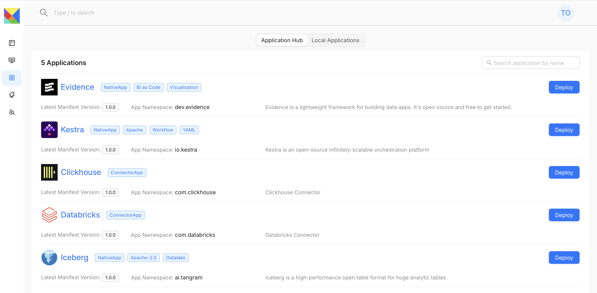

import CreateWorkspace from "/img/create_workspace.png";

# Application

Tangram OS apps are versions of application code and infrastructure that can be deployed into Tangram OS instance.

## What Is An App?

A Tangram OS app is a package of application libraries and manifests that defines app components and necessary infrastructure resources to run those component/services. When installing an app in Tangram OS, the OS control plane will provision the necessary infrastructure resources and deploy the app components.

# Application Hub

Tangram OS Application hub is a repository of apps that can be deployed into a Tangram OS instance, users can publish applications to their private App Hub and also to Tangram OS Central App to share their Applications with others.

:::info

Currently publishing apps to central Tangram OS App Hub is only open to subscribed users or organizations. For more details about applications, please contact us and request Tangram OS cloud access.

:::

